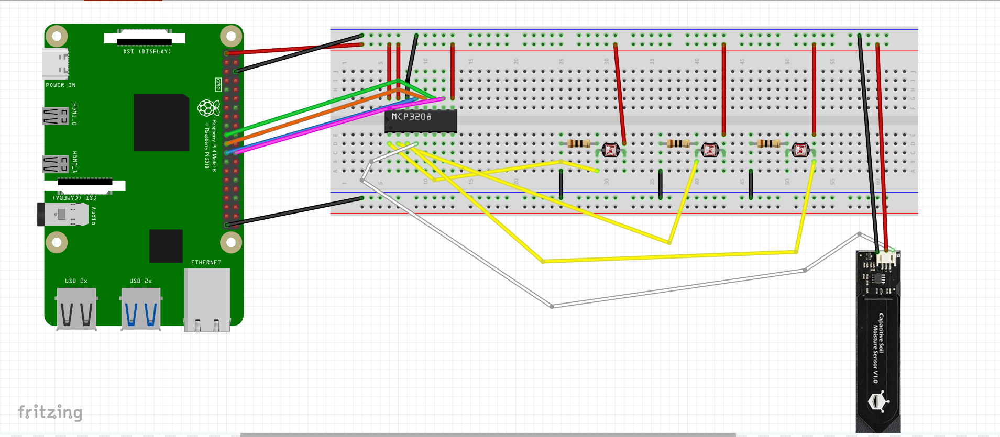

# 植物のつぶやき for RaspberryPi


## 植物のつぶやきとは
植物の観察や記録を自動化するIoTプロダクトです🌱<br>
このリポジトリ（[plant-murmur-raspberrypi](https://github.com/imaikosuke/plant-murmur-raspberrypi)）はRaspberryPiで動かすためのPyhonコードです.

## 使用デバイス
- Raspberry Pi 4(Model B)
- SEN0193（土壌水分センサ）
- CdSセル（照度センサ）
- Logicool C270n HDウェブカメラ
- MCP3208

## 回路図
回路図は以下の通りです（fritzingで作成）：


## インストール手順
1. リポジトリをクローンします:
    ```sh
    git clone https://github.com/imaikosuke/plant-murmur-raspberrypi.git
    cd plant-murmur-raspberrypi
    ```
2. 仮想環境を作成してアクティベートします:
    ```sh
    python3 -m venv/venv
    source venv/bin/activate  # Unix/macOS
    .\venv\Scripts\activate   # Windows
    ```
3. 必要なPythonパッケージをインストールする:
    ```sh
    pip install -r requirements.txt
    ```
4. .envファイルを作成して環境変数を設定します

## 環境変数
| 環境変数名                    | 説明                               |
| ----------------------------- | ---------------------------------- |
| LINE_CHANNEL_ID               | LINEのチャネルID                    |
| LINE_CHANNEL_ACCESS_TOKEN     | LINEのチャネルアクセストークン     |
| AZURE_BLOB_CONNECTION_STRING  | Azure Blob Storageの接続文字列     |
| AZURE_POSTGRESQL_HOST         | Azure PostgreSQLのホスト名         |
| AZURE_POSTGRESQL_USER         | Azure PostgreSQLのユーザー名       |
| AZURE_POSTGRESQL_PASSWORD     | Azure PostgreSQLのパスワード       |
| AZURE_POSTGRESQL_DATABASE     | Azure PostgreSQLのデータベース名   |

## プロジェクト構造
```
plant-murmur-raspberrypi % tree -a -I ".git|__pycache__|venv"  
.
├── .env
├── .gitignore
├── README.md
├── images
│   └── plant-murmur-thumbnail.png
├── requirements.txt
└── src
    ├── __init__.py
    ├── azure
    │   ├── blob_storage.py
    │   ├── get_conn.py
    │   └── postgresql_database.py
    ├── main.py
    ├── notification
    │   └── notification.py
    └── sensor
        ├── brightness.py
        ├── camera.py
        └── soil_moisture.py

6 directories, 14 files
```

## 植物のつぶやき for Web
WebのGitHubリポジトリは[こちら](https://github.com/imaikosuke/plant-murmur-web).<br>
Webアプリケーションでは、２つの機能があります.<br>
1. 植物の土壌水分データの推移グラフを閲覧
2. 植物の成長を写真で振り返り

## 植物のつぶやき for LINE
LINEによる会話を実装したGitHubリポジトリは[こちら](https://github.com/imaikosuke/plant-murmur-line).

OpenAIの生成AIに設定しているプロンプト
```
あなたはユーザーが持ち主の植物です。植物が可愛く話すかのように返信してください。
```